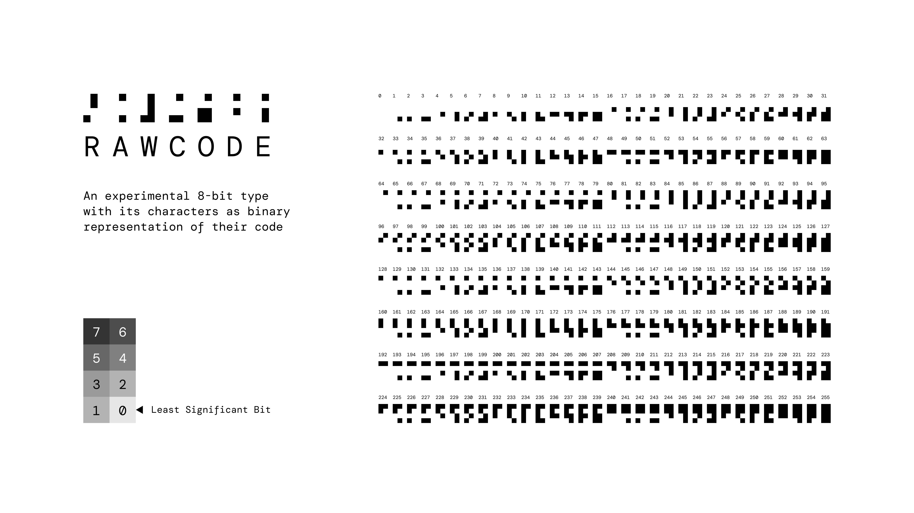

# rawcode

An experimental 8-bit type with its characters as the binary representation of their code

More at https://medium.com/mathscapes/rawcode-an-experimental-8-bit-type-that-is-itself-8a27b20eed0e
